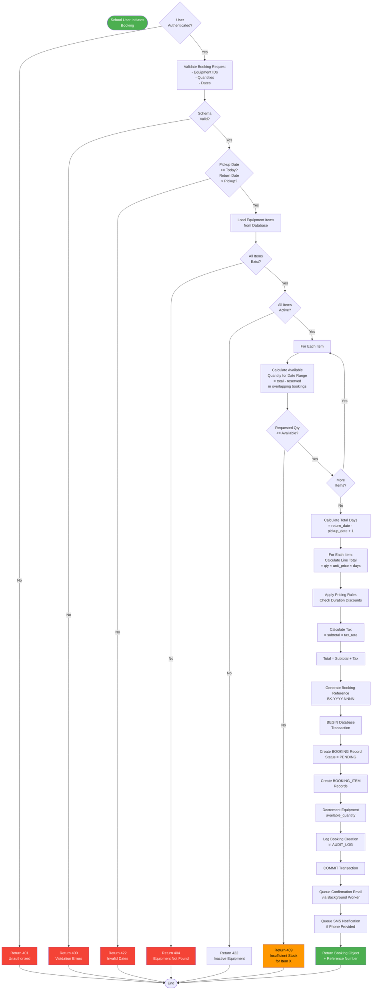
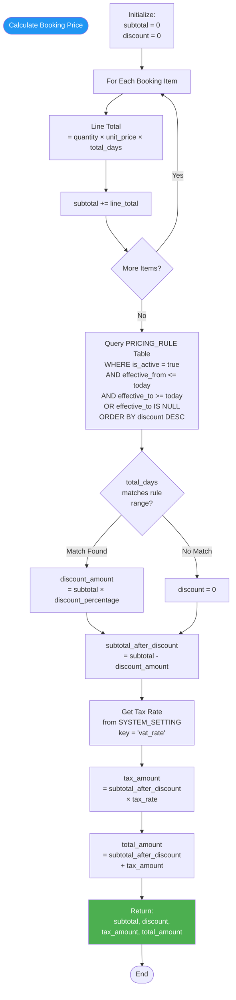
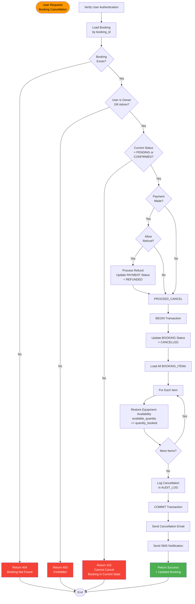

# Booking Module - Structure Chart

## Module Overview
Handles the complete booking workflow from equipment selection to reservation confirmation, including availability checking, pricing calculation, and inventory management.

---

## Main Structure Chart

```mermaid
graph TB
    MAIN["Booking Module"]
    
    MAIN --> BROWSE["Browse Equipment<br/>Controller"]
    MAIN --> CREATE["Create Booking<br/>Controller"]
    MAIN --> MANAGE["Manage Bookings<br/>Controller"]
    MAIN --> VALIDATE["Booking Validation<br/>Service"]
    
    BROWSE --> SEARCH["Search Equipment<br/>by Keyword"]
    BROWSE --> FILTER["Filter by<br/>Category"]
    BROWSE --> AVAIL["Check Availability<br/>for Date Range"]
    
    CREATE --> VAL_REQ["Validate Booking<br/>Request"]
    CREATE --> CHECK_STOCK["Check Equipment<br/>Stock"]
    CREATE --> CALC_PRICE["Calculate Total<br/>Pricing"]
    CREATE --> RESERVE["Reserve Equipment<br/>Inventory"]
    CREATE --> SAVE_BOOKING["Save Booking<br/>Record"]
    CREATE --> NOTIFY["Send Booking<br/>Confirmation"]
    
    MANAGE --> GET_BOOKINGS["Get User<br/>Bookings"]
    MANAGE --> GET_DETAILS["Get Booking<br/>Details"]
    MANAGE --> UPDATE_STATUS["Update Booking<br/>Status"]
    MANAGE --> CANCEL["Cancel Booking"]
    
    VALIDATE --> DATE_VALID["Validate Date<br/>Range"]
    VALIDATE --> QTY_VALID["Validate<br/>Quantities"]
    VALIDATE --> CONFLICT["Check Date<br/>Conflicts"]
    
    SEARCH --> DB_EQUIP[("Equipment DB")]
    FILTER --> DB_EQUIP
    AVAIL --> DB_EQUIP
    AVAIL --> DB_BOOKING[("Bookings DB")]
    
    VAL_REQ --> VALIDATE
    CHECK_STOCK --> DB_EQUIP
    CALC_PRICE --> DB_PRICING[("Pricing Rules DB")]
    RESERVE --> DB_EQUIP
    SAVE_BOOKING --> DB_BOOKING
    NOTIFY --> EMAIL["Email Service"]
    NOTIFY --> SMS["SMS Service"]
    
    GET_BOOKINGS --> DB_BOOKING
    GET_DETAILS --> DB_BOOKING
    UPDATE_STATUS --> DB_BOOKING
    CANCEL --> DB_BOOKING
    CANCEL --> RESTORE["Restore Equipment<br/>Availability"]
    RESTORE --> DB_EQUIP
    
    style MAIN fill:#e1f5ff
    style DB_EQUIP fill:#336791,color:#fff
    style DB_BOOKING fill:#336791,color:#fff
    style DB_PRICING fill:#336791,color:#fff
```



---

## Create Booking Process Flow



---

## Availability Calculation Algorithm

```mermaid
flowchart TD
    START([Check Availability<br/>for Equipment ID<br/>+ Date Range])
    
    QUERY_TOTAL[Query Equipment Table<br/>Get total_quantity<br/>Get available_quantity]
    
    QUERY_TOTAL --> QUERY_BOOKINGS[Query BOOKING + BOOKING_ITEM<br/>WHERE equipment_id = X<br/>AND status NOT IN<br/>'CANCELLED', 'COMPLETED'<br/>AND date_ranges_overlap]
    
    QUERY_BOOKINGS --> SUM_RESERVED[SUM(quantity_booked)<br/>= Total Reserved]
    
    SUM_RESERVED --> CALC_AVAIL[Available for Range<br/>= total_quantity<br/>- total_reserved]
    
    CALC_AVAIL --> RETURN[Return Available Count]
    
    RETURN --> END([End])
    
    style START fill:#2196f3,color:#fff
    style RETURN fill:#4caf50,color:#fff
```

### Date Overlap Logic (SQL)
```sql
-- Two date ranges overlap if:
-- (pickup_a <= return_b) AND (return_a >= pickup_b)

SELECT SUM(quantity_booked) as reserved
FROM BOOKING b
JOIN BOOKING_ITEM bi ON b.booking_id = bi.booking_id
WHERE bi.equipment_id = ?
  AND b.status NOT IN ('CANCELLED', 'COMPLETED')
  AND b.pickup_date <= ?   -- requested return_date
  AND b.return_date >= ?;  -- requested pickup_date
```

---

## Pricing Calculation Algorithm



---

## Cancel Booking Process



---

## Function Specifications

### 1. createBooking()
**Purpose**: Create a new equipment booking with validation and reservation

**Input**:
```json
{
  "user_id": "uuid (from JWT)",
  "items": [
    {
      "equipment_id": "uuid",
      "quantity": 5
    }
  ],
  "pickup_date": "2026-02-15",
  "return_date": "2026-02-20",
  "special_instructions": "Handle with care"
}
```

**Output**:
```json
{
  "success": true,
  "booking": {
    "booking_id": "uuid",
    "booking_reference": "BK-2026-0042",
    "total_amount": 15750.00,
    "status": "PENDING",
    "items": [...],
    "payment_required": true
  }
}
```

**Algorithm**:
1. Validate authentication
2. Validate request schema (dates, items, quantities)
3. Check date logic (pickup >= today, return > pickup)
4. Load equipment items from database
5. Verify all items exist and are active
6. For each item, check available quantity for date range
7. Calculate total days (return - pickup + 1)
8. Calculate pricing:
   - Line totals for each item
   - Apply pricing rules/discounts
   - Calculate tax
9. Generate unique booking reference
10. BEGIN database transaction
11. Create BOOKING record (status = PENDING)
12. Create BOOKING_ITEM records
13. Decrement equipment available_quantity
14. Log action in AUDIT_LOG
15. COMMIT transaction
16. Queue notification emails/SMS
17. Return booking object

**Error Handling**:
- 400: Validation errors
- 401: Unauthorized
- 404: Equipment not found
- 409: Insufficient stock
- 422: Invalid dates or inactive items
- 500: Database errors

---

### 2. checkAvailability()
**Purpose**: Calculate available quantity for equipment in date range

**Input**:
- equipment_id (uuid)
- pickup_date (date)
- return_date (date)

**Output**:
```json
{
  "equipment_id": "uuid",
  "total_quantity": 50,
  "available_quantity": 35,
  "reserved_quantity": 15
}
```

**Algorithm**:
1. Query equipment total_quantity
2. Query SUM of quantities in overlapping bookings:
   - WHERE status NOT IN ('CANCELLED', 'COMPLETED')
   - AND dates overlap (pickup <= return_requested AND return >= pickup_requested)
3. Calculate: available = total - reserved
4. Return availability data

---

### 3. calculatePrice()
**Purpose**: Calculate total booking cost with discounts and tax

**Input**:
- items array (equipment_id, quantity, unit_price)
- total_days (integer)

**Output**:
```json
{
  "subtotal": 10000.00,
  "discount_amount": 1000.00,
  "discount_percentage": 10,
  "subtotal_after_discount": 9000.00,
  "tax_amount": 1440.00,
  "total_amount": 10440.00
}
```

**Algorithm**:
1. Initialize subtotal = 0
2. For each item: subtotal += (qty × unit_price × days)
3. Query active pricing rules matching total_days
4. Apply best discount if found
5. Calculate tax from SYSTEM_SETTING
6. Calculate total = (subtotal - discount) + tax
7. Return pricing breakdown

---

### 4. cancelBooking()
**Purpose**: Cancel booking and restore inventory

**Input**:
- booking_id (uuid)
- user_id (from JWT)

**Output**:
```json
{
  "success": true,
  "booking": {
    "booking_id": "uuid",
    "status": "CANCELLED",
    "refund_processed": true
  }
}
```

**Algorithm**:
1. Load booking by ID
2. Verify ownership or admin role
3. Check status is PENDING/CONFIRMED
4. Check if payment exists
5. Process refund if applicable
6. BEGIN transaction
7. Update booking status = CANCELLED
8. For each booking item:
   - Restore equipment available_quantity
9. Log cancellation
10. COMMIT transaction
11. Send notifications
12. Return updated booking

---

## Database Tables Used

| Table | Operations | Purpose |
|-------|-----------|---------|
| BOOKING | CREATE, READ, UPDATE | Main booking records |
| BOOKING_ITEM | CREATE, READ | Line items in booking |
| EQUIPMENT | READ, UPDATE | Check/update availability |
| PRICING_RULE | READ | Apply discounts |
| SYSTEM_SETTING | READ | Tax rate configuration |
| AUDIT_LOG | CREATE | Track booking actions |
| NOTIFICATION | CREATE | Queue notifications |

---

## Business Rules

1. **Minimum Booking Period**: 1 day
2. **Maximum Advance Booking**: 90 days
3. **Minimum Notice**: 24 hours before pickup
4. **Cancellation Policy**: 
   - Free cancellation > 48 hours before pickup
   - 50% charge if 24-48 hours
   - No refund < 24 hours
5. **Stock Reservation**: Equipment reserved upon booking creation
6. **Booking Expiry**: PENDING bookings auto-cancelled after 48 hours if not paid
