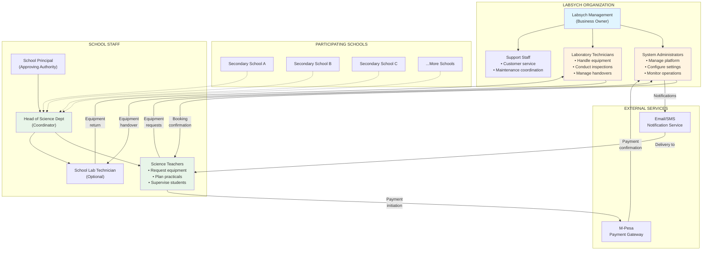
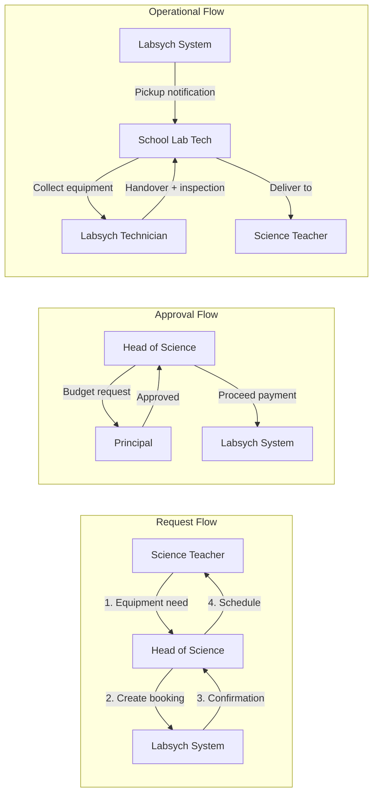
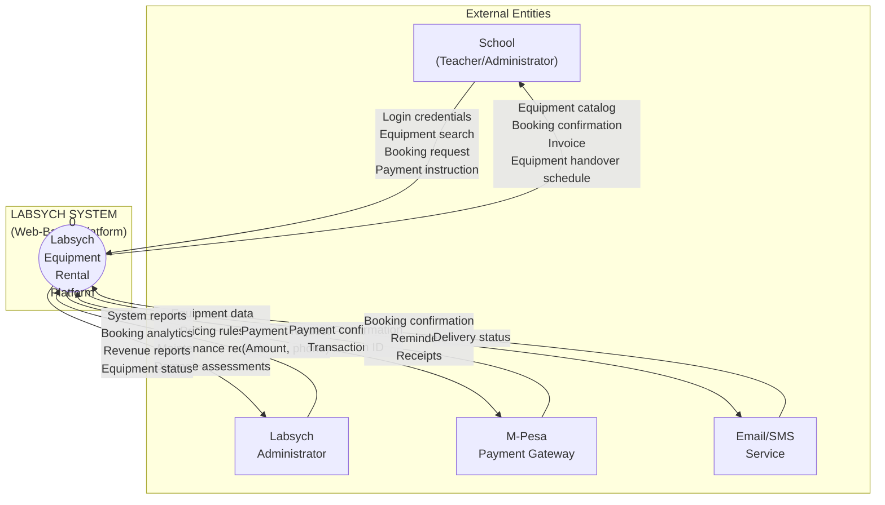
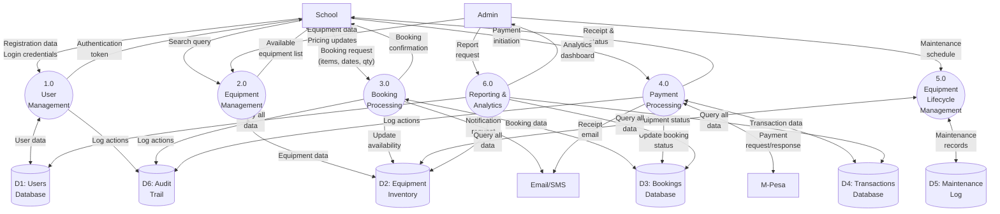
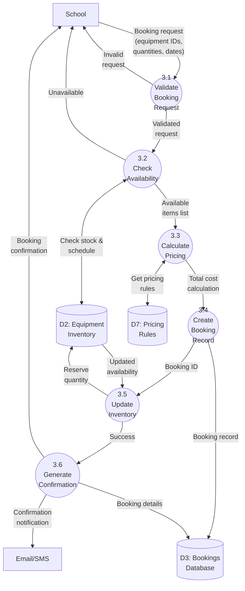
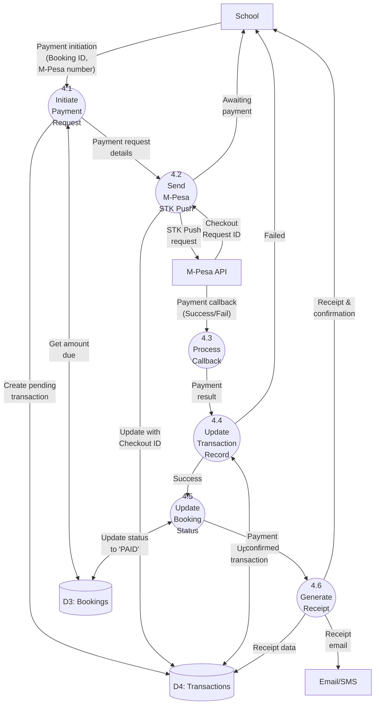
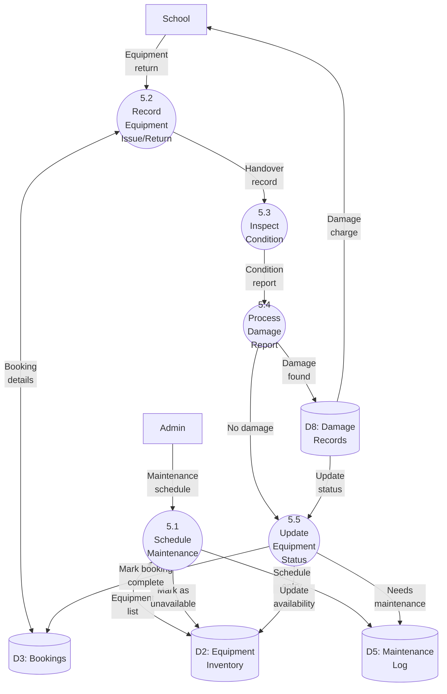

# Data Flow Diagrams (DFD) - Proposed Labsych System

## Description
These diagrams show how data flows through the proposed Labsych digital platform, from user input to system processing to outputs.

---

## Organizational Structure

### 4.5.1 Organizational Structure

The proposed Labsych system will operate within a multi-institutional context involving the following stakeholders:

### Roles and Responsibilities

| Stakeholder | Role | System Interaction | Responsibilities |
|-------------|------|-------------------|------------------|
| **Labsych Management** | Business Owner | Strategic oversight | - Define business policies - Set pricing strategies - Approve major decisions |
| **System Administrators** | Platform Manager | Full system access | - Configure equipment catalog - Manage user accounts - Generate reports - Handle system settings |
| **Laboratory Technicians** | Operations Staff | Equipment management | - Physical equipment handling - Conduct handover/return inspections - Report damages - Coordinate maintenance |
| **Participating Schools** | Client Organization | Institutional entity | - Register with Labsych - Maintain account standing - Ensure equipment safety |
| **School Principal** | Approving Authority | Budget approval | - Authorize equipment bookings - Approve expenditure - Oversee science department |
| **Head of Science** | Department Coordinator | Primary user account | - Coordinate equipment needs - Manage booking calendar - Liaise with Labsych |
| **Science Teachers** | End Users | Equipment requestors | - Request specific equipment - Plan practical sessions - Supervise equipment use - Report issues |
| **School Lab Technician** | School-side Handler | Optional role | - Collect equipment from Labsych - Prepare for lessons - Return equipment - Assist with inspections |

### Communication Hierarchy

---

## Level 0 DFD (Context Diagram)

---

## Level 1 DFD (Major Processes)

---

## Level 2 DFD - Process 3.0 (Booking Processing) Decomposition

---

## Level 2 DFD - Process 4.0 (Payment Processing) Decomposition

---

## Level 2 DFD - Process 5.0 (Equipment Lifecycle) Decomposition

---

## Data Store Descriptions

| ID | Name | Description | Access Pattern |
|----|------|-------------|----------------|
| **D1** | Users Database | Stores school and admin user accounts, credentials, profiles | Read/Write by P1 |
| **D2** | Equipment Inventory | Tracks all equipment items, quantities, availability, status | Read/Write by P2, P3, P5 |
| **D3** | Bookings Database | Records all booking transactions, status, dates | Read/Write by P3, P4, P5 |
| **D4** | Transactions Database | Financial transaction records, M-Pesa references, receipts | Read/Write by P4 |
| **D5** | Maintenance Log | Maintenance schedules, repair records, equipment history | Read/Write by P5 |
| **D6** | Audit Trail | System activity logs for security and debugging | Write-only by all processes |
| **D7** | Pricing Rules | Dynamic pricing algorithm parameters | Read by P3.3 |
| **D8** | Damage Records | Equipment damage reports, photos, charges | Read/Write by P5.4 |

---

## Process Descriptions

### Process 1.0: User Management
Handles school registration, authentication, profile management. Uses KU email verification for schools.

### Process 2.0: Equipment Management
Manages equipment catalog, categorization, pricing, and availability display. Admin can add/edit equipment.

### Process 3.0: Booking Processing
Core booking engine that validates requests, checks availability, calculates pricing, and creates reservations.

### Process 4.0: Payment Processing
Integrates with M-Pesa for payment collection, handles callbacks, generates receipts.

### Process 5.0: Equipment Lifecycle Management
Tracks equipment from issue to return, manages maintenance, handles damage reports.

### Process 6.0: Reporting & Analytics
Generates reports on utilization, revenue, popular items, school activity, system health.

---

## Key Improvements Over Current System

### Real-Time Data Flow
- **Current**: Sequential manual lookups
- **Proposed**: Parallel database queries with instant results

### Automated Notifications
- **Current**: Verbal confirmations only
- **Proposed**: Email/SMS at every stage (booking, payment, reminder, completion)

### Data Integrity
- **Current**: No referential integrity, manual reconciliation
- **Proposed**: Database constraints, automatic consistency checks

### Scalability
- **Current**: Limited by staff availability
- **Proposed**: Handles 100+ concurrent bookings automatically

### Traceability
- **Current**: No audit trail
- **Proposed**: Complete audit log of all transactions (D6)
