# Entity Relationship Diagram - Proposed Labsych System

## Description
This ERD represents the complete database schema for the proposed Labsych platform, normalized to Third Normal Form (3NF).

---

## Complete Entity Relationship Diagram

```mermaid
erDiagram
    USER {
        uuid user_id PK
        string email UK "KU email verified"
        string password_hash
        string full_name
        string phone_number
        enum user_type "SCHOOL|ADMIN"
        boolean is_verified
        timestamp email_verified_at
        timestamp created_at
        timestamp last_login
    }
    
    SCHOOL_PROFILE {
        uuid profile_id PK
        uuid user_id FK "1:1 with USER"
        string school_name
        string registration_number
        string physical_address
        string county
        string contact_person
        string contact_designation
        decimal credit_limit
        enum account_status "ACTIVE|SUSPENDED|BLOCKED"
    }
    
    EQUIPMENT_CATEGORY {
        uuid category_id PK
        string category_name UK
        string description
        string icon_url
        int display_order
    }
    
    EQUIPMENT {
        uuid equipment_id PK
        uuid category_id FK
        string equipment_name
        string equipment_code UK "e.g., EQP-001"
        text description
        int total_quantity
        int available_quantity
        decimal unit_price_per_day
        enum condition "NEW|GOOD|FAIR|NEEDS_MAINTENANCE"
        string storage_location
        boolean is_active
        timestamp created_at
        timestamp updated_at
    }
    
    EQUIPMENT_IMAGE {
        uuid image_id PK
        uuid equipment_id FK
        string image_url
        int display_order
        boolean is_primary
        timestamp uploaded_at
    }
    
    BOOKING {
        uuid booking_id PK
        string booking_reference UK "e.g., BK-2026-0001"
        uuid school_id FK "from SCHOOL_PROFILE"
        date pickup_date
        date return_date
        int total_days
        decimal subtotal
        decimal tax_amount
        decimal total_amount
        enum status "PENDING|CONFIRMED|PAID|ISSUED|COMPLETED|CANCELLED"
        text special_instructions
        uuid created_by FK "USER"
        timestamp created_at
        timestamp updated_at
    }
    
    BOOKING_ITEM {
        uuid booking_item_id PK
        uuid booking_id FK
        uuid equipment_id FK
        int quantity_booked
        decimal unit_price
        decimal line_total
        text notes
    }
    
    PAYMENT {
        uuid payment_id PK
        string transaction_ref UK "e.g., TXN-2026-0001"
        uuid booking_id FK
        decimal amount_paid
        enum payment_method "MPESA|BANK_TRANSFER|CASH|CHEQUE"
        string mpesa_transaction_id
        string mpesa_phone_number
        string mpesa_checkout_request_id
        enum payment_status "PENDING|SUCCESS|FAILED|REFUNDED"
        timestamp initiated_at
        timestamp completed_at
        text callback_response
    }
    
    EQUIPMENT_ISSUANCE {
        uuid issuance_id PK
        uuid booking_id FK
        uuid issued_by FK "ADMIN USER"
        uuid received_by FK "SCHOOL USER"
        timestamp issued_at
        text issue_notes
        string issue_photo_url
    }
    
    EQUIPMENT_RETURN {
        uuid return_id PK
        uuid booking_id FK
        uuid received_by FK "ADMIN USER"
        uuid returned_by FK "SCHOOL USER"
        timestamp returned_at
        text return_notes
        string return_photo_url
        boolean has_damage
    }
    
    DAMAGE_REPORT {
        uuid damage_id PK
        uuid return_id FK
        uuid booking_item_id FK
        uuid equipment_id FK
        text damage_description
        enum severity "MINOR|MODERATE|SEVERE"
        decimal estimated_repair_cost
        decimal charge_amount
        string damage_photo_url
        uuid assessed_by FK "ADMIN USER"
        timestamp assessed_at
        enum resolution_status "PENDING|CHARGED|WAIVED|REPAIRED"
    }
    
    MAINTENANCE_SCHEDULE {
        uuid schedule_id PK
        uuid equipment_id FK
        enum maintenance_type "ROUTINE|REPAIR|CALIBRATION|INSPECTION"
        date scheduled_date
        date completed_date
        text description
        decimal cost
        uuid scheduled_by FK "ADMIN USER"
        enum status "SCHEDULED|IN_PROGRESS|COMPLETED|CANCELLED"
    }
    
    PRICING_RULE {
        uuid rule_id PK
        uuid category_id FK
        int min_days
        int max_days
        decimal discount_percentage
        date effective_from
        date effective_to
        boolean is_active
    }
    
    NOTIFICATION {
        uuid notification_id PK
        uuid user_id FK
        enum notification_type "BOOKING|PAYMENT|RETURN|DAMAGE|MAINTENANCE"
        string title
        text message
        enum delivery_channel "EMAIL|SMS|IN_APP"
        boolean is_sent
        timestamp sent_at
        boolean is_read
        timestamp read_at
    }
    
    AUDIT_LOG {
        uuid log_id PK
        uuid user_id FK
        enum action_type "CREATE|UPDATE|DELETE|LOGIN|LOGOUT"
        string entity_type "USER|BOOKING|PAYMENT|EQUIPMENT"
        uuid entity_id
        text description
        string ip_address
        text user_agent
        timestamp created_at
    }
    
    SYSTEM_SETTING {
        uuid setting_id PK
        string setting_key UK
        string setting_value
        string description
        enum data_type "STRING|NUMBER|BOOLEAN|JSON"
        timestamp updated_at
        uuid updated_by FK "ADMIN USER"
    }
    
    %% Relationships
    USER ||--o| SCHOOL_PROFILE : "has profile"
    USER ||--o{ BOOKING : "creates"
    USER ||--o{ AUDIT_LOG : "performs actions"
    USER ||--o{ NOTIFICATION : "receives"
    
    SCHOOL_PROFILE ||--o{ BOOKING : "makes"
    
    EQUIPMENT_CATEGORY ||--o{ EQUIPMENT : "contains"
    EQUIPMENT_CATEGORY ||--o{ PRICING_RULE : "has rules"
    
    EQUIPMENT ||--o{ EQUIPMENT_IMAGE : "has images"
    EQUIPMENT ||--o{ BOOKING_ITEM : "booked in"
    EQUIPMENT ||--o{ MAINTENANCE_SCHEDULE : "requires maintenance"
    EQUIPMENT ||--o{ DAMAGE_REPORT : "may be damaged"
    
    BOOKING ||--|{ BOOKING_ITEM : "contains"
    BOOKING ||--o| PAYMENT : "has payment"
    BOOKING ||--o| EQUIPMENT_ISSUANCE : "recorded in"
    BOOKING ||--o| EQUIPMENT_RETURN : "recorded in"
    
    BOOKING_ITEM ||--o{ DAMAGE_REPORT : "may have damage"
    
    EQUIPMENT_RETURN ||--o{ DAMAGE_REPORT : "may generate"
    
    USER ||--o{ EQUIPMENT_ISSUANCE : "admin issues"
    USER ||--o{ EQUIPMENT_ISSUANCE : "school receives"
    USER ||--o{ EQUIPMENT_RETURN : "admin receives"
    USER ||--o{ EQUIPMENT_RETURN : "school returns"
    USER ||--o{ DAMAGE_REPORT : "admin assesses"
    USER ||--o{ MAINTENANCE_SCHEDULE : "admin schedules"
    USER ||--o{ SYSTEM_SETTING : "admin updates"
```



---

## Entity Descriptions

### USER
Core authentication and authorization entity. Supports two user types: SCHOOL (school administrators) and ADMIN (Labsych staff).

| Attribute | Type | Constraints | Description |
|-----------|------|-------------|-------------|
| user_id | UUID | PK | Unique identifier |
| email | String | UK, NOT NULL | KU email address (verified) |
| password_hash | String | NOT NULL | Bcrypt hashed password |
| full_name | String | NOT NULL | User's full name |
| phone_number | String | | Contact number |
| user_type | Enum | NOT NULL | SCHOOL or ADMIN |
| is_verified | Boolean | DEFAULT FALSE | Email verification status |
| email_verified_at | Timestamp | | When email was verified |
| created_at | Timestamp | DEFAULT NOW | Account creation time |
| last_login | Timestamp | | Last login timestamp |

---

### SCHOOL_PROFILE
Extended profile information specific to school users (1:1 relationship with USER where user_type = 'SCHOOL').

| Attribute | Type | Constraints | Description |
|-----------|------|-------------|-------------|
| profile_id | UUID | PK | Unique identifier |
| user_id | UUID | FK, UK | Links to USER table |
| school_name | String | NOT NULL | Official school name |
| registration_number | String | UK | Ministry of Education reg number |
| physical_address | Text | | School location |
| county | String | | County (e.g., Kiambu) |
| contact_person | String | | Head of Science/Principal |
| contact_designation | String | | Their title/position |
| credit_limit | Decimal | DEFAULT 0 | For future credit facility |
| account_status | Enum | DEFAULT ACTIVE | ACTIVE, SUSPENDED, BLOCKED |

---

### EQUIPMENT_CATEGORY
Equipment classification for easy browsing and pricing rules.

| Attribute | Type | Constraints | Description |
|-----------|------|-------------|-------------|
| category_id | UUID | PK | Unique identifier |
| category_name | String | UK, NOT NULL | E.g., "Glassware", "Optical Instruments" |
| description | Text | | Category description |
| icon_url | String | | Icon for UI display |
| display_order | Integer | DEFAULT 0 | Sort order in catalog |

**Sample Categories**: Glassware, Optical Instruments, Measuring Instruments, Chemical Equipment, Heating Equipment, Safety Equipment

---

### EQUIPMENT
Individual equipment items available for rent.

| Attribute | Type | Constraints | Description |
|-----------|------|-------------|-------------|
| equipment_id | UUID | PK | Unique identifier |
| category_id | UUID | FK, NOT NULL | Links to EQUIPMENT_CATEGORY |
| equipment_name | String | NOT NULL | E.g., "Compound Microscope 400x" |
| equipment_code | String | UK, NOT NULL | Internal code: EQP-001 |
| description | Text | | Detailed specifications |
| total_quantity | Integer | NOT NULL, ≥ 0 | Total units owned |
| available_quantity | Integer | NOT NULL, ≥ 0 | Currently available |
| unit_price_per_day | Decimal | NOT NULL, > 0 | Daily rental rate |
| condition | Enum | DEFAULT GOOD | NEW, GOOD, FAIR, NEEDS_MAINTENANCE |
| storage_location | String | | Warehouse location |
| is_active | Boolean | DEFAULT TRUE | If false, hidden from catalog |
| created_at | Timestamp | DEFAULT NOW | When added to inventory |
| updated_at | Timestamp | | Last modification |

**Constraint**: available_quantity ≤ total_quantity

---

### EQUIPMENT_IMAGE
Multiple images per equipment item for better product display.

| Attribute | Type | Constraints | Description |
|-----------|------|-------------|-------------|
| image_id | UUID | PK | Unique identifier |
| equipment_id | UUID | FK, NOT NULL | Links to EQUIPMENT |
| image_url | String | NOT NULL | Cloud storage URL |
| display_order | Integer | DEFAULT 0 | Order in gallery |
| is_primary | Boolean | DEFAULT FALSE | Main thumbnail image |
| uploaded_at | Timestamp | DEFAULT NOW | Upload timestamp |

---

### BOOKING
Main booking/reservation entity.

| Attribute | Type | Constraints | Description |
|-----------|------|-------------|-------------|
| booking_id | UUID | PK | Unique identifier |
| booking_reference | String | UK, NOT NULL | Human-readable: BK-2026-0001 |
| school_id | UUID | FK, NOT NULL | Links to SCHOOL_PROFILE |
| pickup_date | Date | NOT NULL | Equipment collection date |
| return_date | Date | NOT NULL | Expected return date |
| total_days | Integer | COMPUTED | return_date - pickup_date + 1 |
| subtotal | Decimal | NOT NULL | Sum of booking_items |
| tax_amount | Decimal | DEFAULT 0 | VAT if applicable |
| total_amount | Decimal | NOT NULL | subtotal + tax_amount |
| status | Enum | DEFAULT PENDING | Booking lifecycle status |
| special_instructions | Text | | E.g., "Fragile items, handle with care" |
| created_by | UUID | FK, NOT NULL | USER who created booking |
| created_at | Timestamp | DEFAULT NOW | Booking creation time |
| updated_at | Timestamp | | Last status change |

**Status Flow**: PENDING → CONFIRMED → PAID → ISSUED → COMPLETED (or CANCELLED at any stage)

**Constraint**: return_date > pickup_date

---

### BOOKING_ITEM
Line items within a booking (many-to-many between BOOKING and EQUIPMENT).

| Attribute | Type | Constraints | Description |
|-----------|------|-------------|-------------|
| booking_item_id | UUID | PK | Unique identifier |
| booking_id | UUID | FK, NOT NULL | Links to BOOKING |
| equipment_id | UUID | FK, NOT NULL | Links to EQUIPMENT |
| quantity_booked | Integer | NOT NULL, > 0 | Number of units |
| unit_price | Decimal | NOT NULL | Price per day (snapshot) |
| line_total | Decimal | COMPUTED | quantity × unit_price × days |
| notes | Text | | Item-specific notes |

---

### PAYMENT
Financial transaction records integrated with M-Pesa.

| Attribute | Type | Constraints | Description |
|-----------|------|-------------|-------------|
| payment_id | UUID | PK | Unique identifier |
| transaction_ref | String | UK, NOT NULL | TXN-2026-0001 |
| booking_id | UUID | FK, NOT NULL | Links to BOOKING |
| amount_paid | Decimal | NOT NULL, > 0 | Payment amount |
| payment_method | Enum | NOT NULL | MPESA, BANK_TRANSFER, CASH, CHEQUE |
| mpesa_transaction_id | String | | M-Pesa confirmation code |
| mpesa_phone_number | String | | Payer's phone number |
| mpesa_checkout_request_id | String | | STK Push request ID |
| payment_status | Enum | DEFAULT PENDING | PENDING, SUCCESS, FAILED, REFUNDED |
| initiated_at | Timestamp | DEFAULT NOW | When payment started |
| completed_at | Timestamp | | When payment confirmed |
| callback_response | Text | | Full M-Pesa callback JSON |

---

### EQUIPMENT_ISSUANCE
Records equipment handover from Labsych to school.

| Attribute | Type | Constraints | Description |
|-----------|------|-------------|-------------|
| issuance_id | UUID | PK | Unique identifier |
| booking_id | UUID | FK, UK, NOT NULL | One issuance per booking |
| issued_by | UUID | FK, NOT NULL | Admin user who handed over |
| received_by | UUID | FK, NOT NULL | School user who collected |
| issued_at | Timestamp | DEFAULT NOW | Handover timestamp |
| issue_notes | Text | | Condition notes at handover |
| issue_photo_url | String | | Photo proof of items issued |

---

### EQUIPMENT_RETURN
Records equipment return from school to Labsych.

| Attribute | Type | Constraints | Description |
|-----------|------|-------------|-------------|
| return_id | UUID | PK | Unique identifier |
| booking_id | UUID | FK, UK, NOT NULL | One return per booking |
| received_by | UUID | FK, NOT NULL | Admin who received back |
| returned_by | UUID | FK, NOT NULL | School user who returned |
| returned_at | Timestamp | DEFAULT NOW | Return timestamp |
| return_notes | Text | | Inspection notes |
| return_photo_url | String | | Photo proof of condition |
| has_damage | Boolean | DEFAULT FALSE | Flag if damage detected |

---

### DAMAGE_REPORT
Damage documentation and charging.

| Attribute | Type | Constraints | Description |
|-----------|------|-------------|-------------|
| damage_id | UUID | PK | Unique identifier |
| return_id | UUID | FK, NOT NULL | Links to EQUIPMENT_RETURN |
| booking_item_id | UUID | FK, NOT NULL | Specific item damaged |
| equipment_id | UUID | FK, NOT NULL | Equipment reference |
| damage_description | Text | NOT NULL | What was damaged and how |
| severity | Enum | NOT NULL | MINOR, MODERATE, SEVERE |
| estimated_repair_cost | Decimal | | Repair/replacement cost |
| charge_amount | Decimal | NOT NULL | Amount charged to school |
| damage_photo_url | String | | Photo evidence |
| assessed_by | UUID | FK, NOT NULL | Admin who assessed |
| assessed_at | Timestamp | DEFAULT NOW | Assessment time |
| resolution_status | Enum | DEFAULT PENDING | PENDING, CHARGED, WAIVED, REPAIRED |

---

### MAINTENANCE_SCHEDULE
Preventive and corrective maintenance tracking.

| Attribute | Type | Constraints | Description |
|-----------|------|-------------|-------------|
| schedule_id | UUID | PK | Unique identifier |
| equipment_id | UUID | FK, NOT NULL | Equipment to maintain |
| maintenance_type | Enum | NOT NULL | ROUTINE, REPAIR, CALIBRATION, INSPECTION |
| scheduled_date | Date | NOT NULL | When maintenance is due |
| completed_date | Date | | When actually completed |
| description | Text | | What needs to be done |
| cost | Decimal | DEFAULT 0 | Maintenance cost |
| scheduled_by | UUID | FK, NOT NULL | Admin who scheduled |
| status | Enum | DEFAULT SCHEDULED | SCHEDULED, IN_PROGRESS, COMPLETED, CANCELLED |

---

### PRICING_RULE
Dynamic pricing based on rental duration and category.

| Attribute | Type | Constraints | Description |
|-----------|------|-------------|-------------|
| rule_id | UUID | PK | Unique identifier |
| category_id | UUID | FK, NOT NULL | Equipment category |
| min_days | Integer | NOT NULL, > 0 | Minimum rental days |
| max_days | Integer | NOT NULL | Maximum rental days |
| discount_percentage | Decimal | DEFAULT 0, ≥ 0 | Discount for this range |
| effective_from | Date | NOT NULL | Rule start date |
| effective_to | Date | | Rule end date (NULL = forever) |
| is_active | Boolean | DEFAULT TRUE | Enable/disable rule |

**Example**: 7-14 days = 10% discount, 15-30 days = 20% discount

**Constraint**: max_days > min_days

---

### NOTIFICATION
Email/SMS notification tracking.

| Attribute | Type | Constraints | Description |
|-----------|------|-------------|-------------|
| notification_id | UUID | PK | Unique identifier |
| user_id | UUID | FK, NOT NULL | Recipient user |
| notification_type | Enum | NOT NULL | Category of notification |
| title | String | NOT NULL | Notification subject |
| message | Text | NOT NULL | Notification body |
| delivery_channel | Enum | NOT NULL | EMAIL, SMS, IN_APP |
| is_sent | Boolean | DEFAULT FALSE | Delivery status |
| sent_at | Timestamp | | When delivered |
| is_read | Boolean | DEFAULT FALSE | Read status (in-app only) |
| read_at | Timestamp | | When read |

---

### AUDIT_LOG
Complete audit trail for compliance and debugging.

| Attribute | Type | Constraints | Description |
|-----------|------|-------------|-------------|
| log_id | UUID | PK | Unique identifier |
| user_id | UUID | FK | User who performed action (NULL for system) |
| action_type | Enum | NOT NULL | CREATE, UPDATE, DELETE, LOGIN, LOGOUT |
| entity_type | String | NOT NULL | Table/entity affected |
| entity_id | UUID | | ID of affected entity |
| description | Text | | Human-readable description |
| ip_address | String | | User's IP address |
| user_agent | Text | | Browser/device info |
| created_at | Timestamp | DEFAULT NOW | When action occurred |

---

### SYSTEM_SETTING
Configuration parameters (e.g., tax rate, business hours, contact info).

| Attribute | Type | Constraints | Description |
|-----------|------|-------------|-------------|
| setting_id | UUID | PK | Unique identifier |
| setting_key | String | UK, NOT NULL | E.g., "vat_rate", "max_booking_days" |
| setting_value | String | NOT NULL | Value as string |
| description | String | | What this setting controls |
| data_type | Enum | DEFAULT STRING | STRING, NUMBER, BOOLEAN, JSON |
| updated_at | Timestamp | DEFAULT NOW | Last modification |
| updated_by | UUID | FK | Admin who updated |

---

## Normalization Documentation

### First Normal Form (1NF)
✅ **All tables satisfy 1NF:**
- Each column contains atomic values (no arrays or nested structures)
- Each record is unique (enforced by primary keys)
- No repeating groups

### Second Normal Form (2NF)
✅ **All tables satisfy 2NF:**
- Already in 1NF
- All non-key attributes are fully functionally dependent on the primary key
- No partial dependencies (relevant only for composite keys - we use UUIDs)

### Third Normal Form (3NF)
✅ **All tables satisfy 3NF:**
- Already in 2NF
- No transitive dependencies
- All non-key attributes depend only on the primary key

**Example of Normalization**:
- **BOOKING_ITEM.line_total** is computed, not stored (prevents update anomalies)
- **BOOKING.total_days** is computed from dates
- School contact info is in SCHOOL_PROFILE, not duplicated in BOOKING
- Equipment pricing rules are separate table (PRICING_RULE) not embedded in EQUIPMENT

---

## Database Indexes (For Performance)

```sql
-- User lookups
CREATE INDEX idx_user_email ON USER(email);
CREATE INDEX idx_user_type ON USER(user_type);

-- Equipment searches
CREATE INDEX idx_equipment_category ON EQUIPMENT(category_id);
CREATE INDEX idx_equipment_active ON EQUIPMENT(is_active);
CREATE INDEX idx_equipment_available ON EQUIPMENT(available_quantity);

-- Booking queries
CREATE INDEX idx_booking_school ON BOOKING(school_id);
CREATE INDEX idx_booking_status ON BOOKING(status);
CREATE INDEX idx_booking_dates ON BOOKING(pickup_date, return_date);

-- Payment tracking
CREATE INDEX idx_payment_booking ON PAYMENT(booking_id);
CREATE INDEX idx_payment_status ON PAYMENT(payment_status);
CREATE INDEX idx_payment_mpesa ON PAYMENT(mpesa_transaction_id);

-- Audit queries
CREATE INDEX idx_audit_user ON AUDIT_LOG(user_id);
CREATE INDEX idx_audit_date ON AUDIT_LOG(created_at);
```

---

## Business Rules Enforced by Database

1. **Availability Check**: `available_quantity` ≤ `total_quantity` (CHECK constraint)
2. **Date Logic**: `return_date` > `pickup_date` (CHECK constraint)
3. **Quantity Validation**: All quantities > 0 (CHECK constraint)
4. **Unique References**: Booking/transaction refs are unique (UNIQUE constraint)
5. **Cascading Deletes**: 
   - Delete USER → cascade to SCHOOL_PROFILE
   - Delete BOOKING → cascade to BOOKING_ITEMs, PAYMENT
6. **Status Transitions**: Enforced by application logic (state machine)
7. **Credit Limits**: Future feature, enforced at application layer
