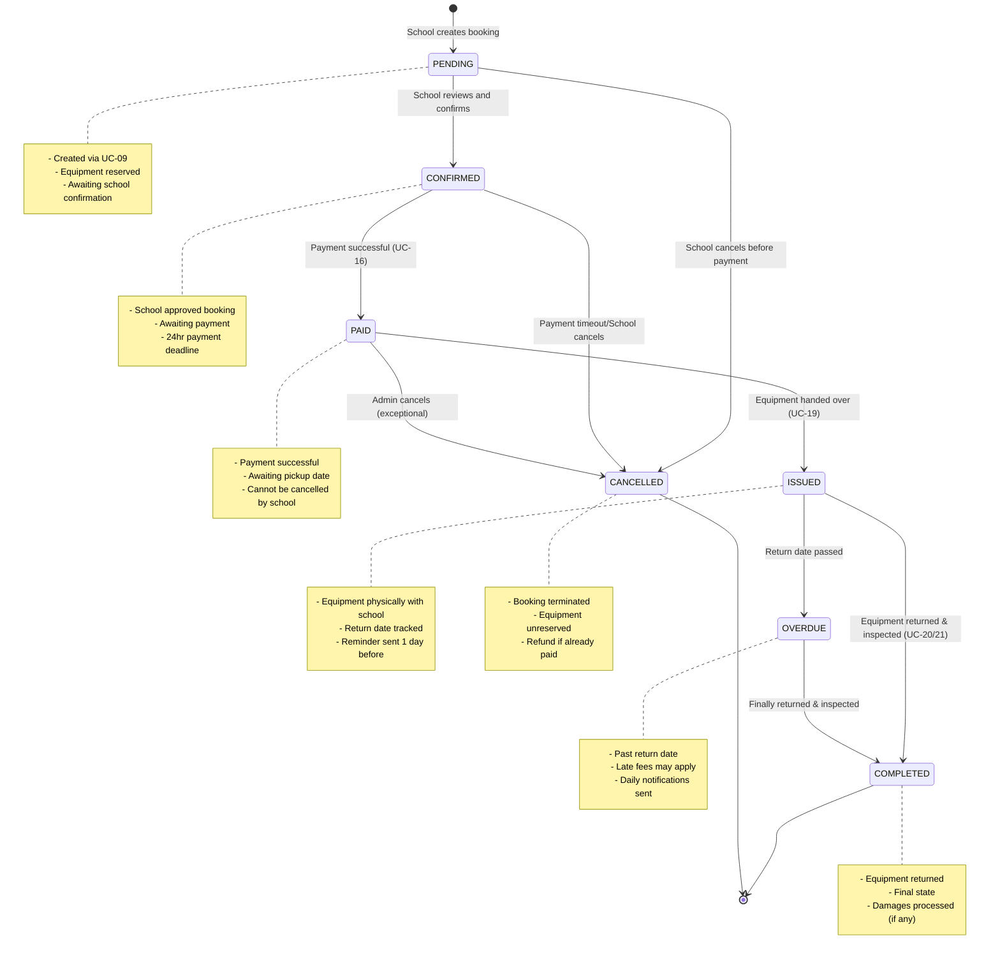
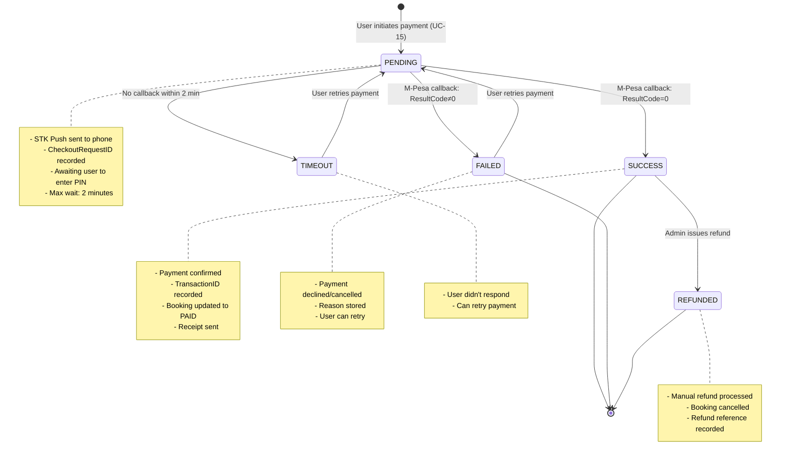
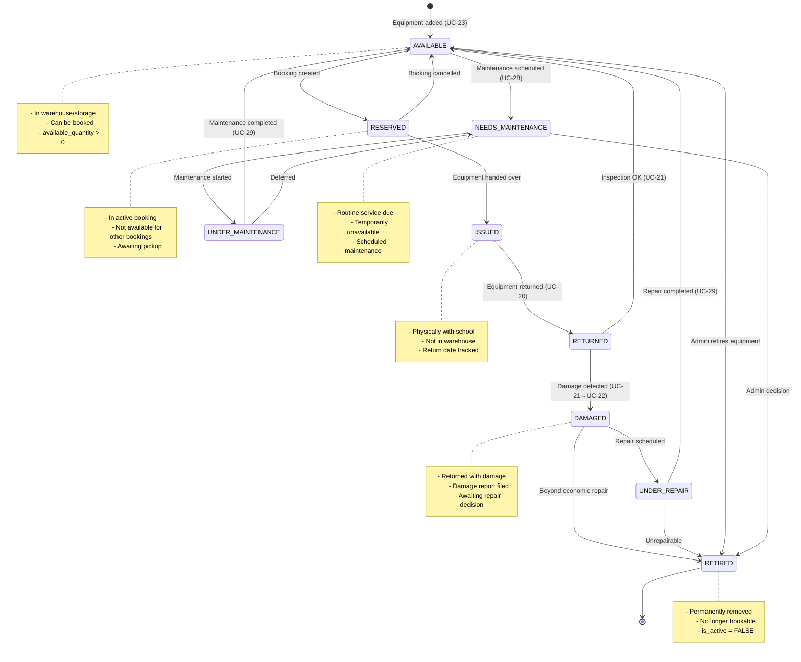
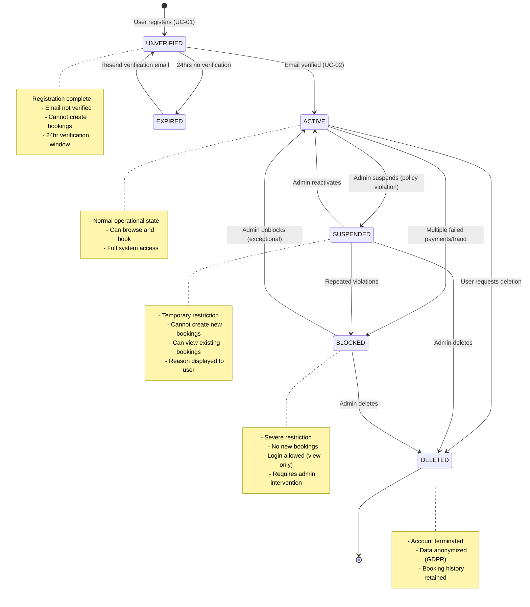
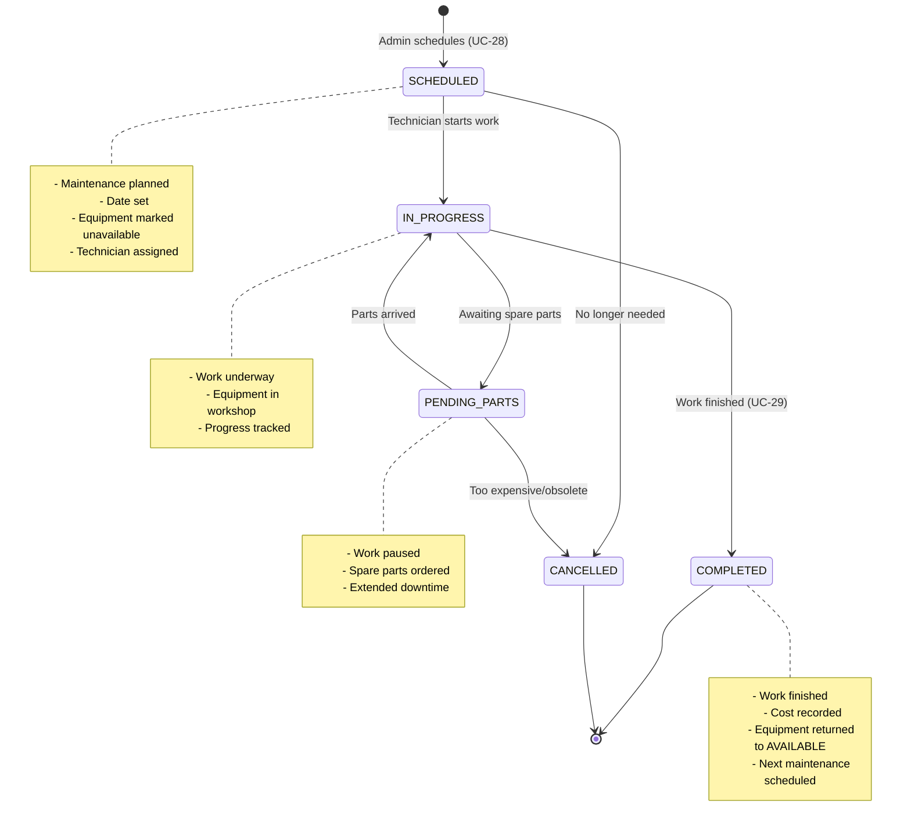
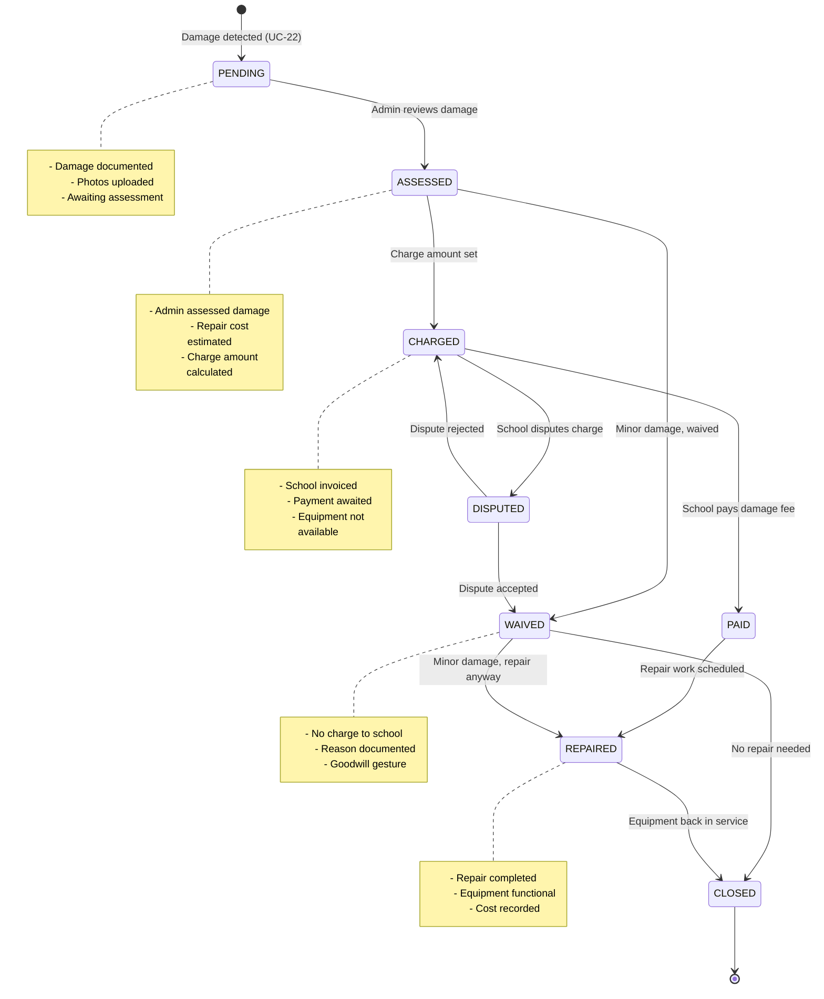

# State Transition Diagrams - Proposed Labsych System

## Description
State machines showing the lifecycle and valid state transitions for key entities in the Labsych system.

---

## 1. Booking State Transition Diagram



### Booking State Descriptions

| State | Description | Entry Condition | Exit Condition | Timeout |
|-------|-------------|-----------------|----------------|---------|
| **PENDING** | Initial draft state after creation | UC-09 executed | School confirms or cancels | 24 hours |
| **CONFIRMED** | School approved, awaiting payment | School clicks "Confirm" | Payment received or cancelled | 24 hours |
| **PAID** | Payment successful | M-Pesa callback success (UC-16) | Equipment issued or admin cancel | Until pickup_date |
| **ISSUED** | Equipment in school's possession | UC-19 completed | Equipment returned | Until return_date |
| **OVERDUE** | Past return date, not yet returned | return_date + 1 day | Equipment returned | No limit |
| **COMPLETED** | Successfully closed | UC-20/21 completed, no damage or damage resolved | Terminal state | - |
| **CANCELLED** | Booking terminated | Cancellation triggered | Terminal state | - |

### State Transition Rules

```javascript
// Allowed state transitions (enforced at application layer)
const BOOKING_TRANSITIONS = {
  PENDING: ['CONFIRMED', 'CANCELLED'],
  CONFIRMED: ['PAID', 'CANCELLED'],
  PAID: ['ISSUED', 'CANCELLED'], // CANCELLED only by admin
  ISSUED: ['COMPLETED', 'OVERDUE'],
  OVERDUE: ['COMPLETED'],
  COMPLETED: [], // Terminal
  CANCELLED: []  // Terminal
};

// Validation function
function canTransition(currentState, newState) {
  return BOOKING_TRANSITIONS[currentState].includes(newState);
}
```

---

## 2. Payment State Transition Diagram



### Payment State Business Rules

| State | M-Pesa Action | Booking Impact | Retryable |
|-------|---------------|----------------|-----------|
| **PENDING** | STK Push sent | No change | - |
| **SUCCESS** | Payment confirmed | Status → PAID | No |
| **FAILED** | Payment rejected | Status unchanged | Yes (new payment) |
| **TIMEOUT** | No response | Status unchanged | Yes (same payment can retry) |
| **REFUNDED** | Manual M-Pesa reversal | Status → CANCELLED | No |

---

## 3. Equipment Status State Transition Diagram



### Equipment Availability Logic

```javascript
// How available_quantity is calculated
function updateEquipmentAvailability(equipmentId) {
  const equipment = getEquipment(equipmentId);
  
  // Count units in active bookings (RESERVED or ISSUED)
  const reservedUnits = countUnitsInBookings(equipmentId, 
    ['RESERVED', 'ISSUED']
  );
  
  // Count units under maintenance/repair
  const maintenanceUnits = countUnitsInMaintenance(equipmentId);
  
  // Available = Total - Reserved - Under Maintenance
  const availableQuantity = equipment.total_quantity 
                          - reservedUnits 
                          - maintenanceUnits;
  
  updateDatabase(equipmentId, { available_quantity: availableQuantity });
  
  return availableQuantity;
}
```

---

## 4. User Account State Transition Diagram



### User Account Triggers

| Trigger Event | From State | To State | Actor |
|--------------|------------|----------|-------|
| Registration complete | - | UNVERIFIED | System |
| Email verification link clicked | UNVERIFIED | ACTIVE | User |
| 24hrs elapsed, no verification | UNVERIFIED | EXPIRED | System (cron job) |
| Admin suspends (manual) | ACTIVE | SUSPENDED | Admin |
| Payment failed 3 times | ACTIVE | BLOCKED | System |
| Damage not paid for 30 days | ACTIVE | BLOCKED | System |
| Admin reactivates | SUSPENDED | ACTIVE | Admin |
| User/admin deletes account | ANY | DELETED | User/Admin |

---

## 5. Maintenance Ticket State Diagram



---

## 6. Damage Report State Diagram



---

## State Machine Implementation Notes

### Database Storage
Each state is stored as an ENUM field in the respective table:
- `BOOKING.status`
- `PAYMENT.payment_status`
- `EQUIPMENT.condition` (proxy for status)
- `USER.account_status`
- `MAINTENANCE_SCHEDULE.status`
- `DAMAGE_REPORT.resolution_status`

### State Change Logging
Every state transition is logged in `AUDIT_LOG`:

```javascript
function transitionState(entity, entityId, fromState, toState, reason, userId) {
  // Validate transition is allowed
  if (!isValidTransition(entity, fromState, toState)) {
    throw new Error(`Invalid transition: ${fromState} → ${toState}`);
  }
  
  // Update entity state
  updateEntityState(entity, entityId, toState);
  
  // Log transition
  createAuditLog({
    user_id: userId,
    action_type: 'UPDATE',
    entity_type: entity,
    entity_id: entityId,
    description: `State changed: ${fromState} → ${toState}. Reason: ${reason}`
  });
  
  // Trigger side effects (notifications, updates)
  handleStateTransitionSideEffects(entity, entityId, toState);
}
```

### Automated State Transitions
Some transitions are triggered by system cron jobs:

```javascript
// Daily cron job (runs at midnight)
async function checkOverdueBookings() {
  const overdueBookings = await db.query(`
    SELECT booking_id FROM BOOKING 
    WHERE status = 'ISSUED' 
    AND return_date < CURRENT_DATE
  `);
  
  for (const booking of overdueBookings) {
    transitionState('BOOKING', booking.booking_id, 
      'ISSUED', 'OVERDUE', 
      'Automatic: return date passed', 
      SYSTEM_USER_ID
    );
    
    // Send overdue notification
    sendNotification(booking.school_id, 'OVERDUE_NOTICE');
  }
}

// Hourly cron job
async function checkPendingBookingExpiry() {
  const expiredBookings = await db.query(`
    SELECT booking_id FROM BOOKING 
    WHERE status = 'PENDING' 
    AND created_at < NOW() - INTERVAL '24 hours'
  `);
  
  for (const booking of expiredBookings) {
    transitionState('BOOKING', booking.booking_id, 
      'PENDING', 'CANCELLED', 
      'Automatic: 24hr confirmation timeout', 
      SYSTEM_USER_ID
    );
  }
}
```

---

## Key Insights from State Diagrams

### 1. No Backwards Movement
- States generally progress forward (PENDING → CONFIRMED → PAID → ISSUED → COMPLETED)
- Exceptions: TIMEOUT → PENDING (payment retry), SUSPENDED → ACTIVE (reactivation)

### 2. Terminal States
- **COMPLETED**, **CANCELLED** (bookings)
- **SUCCESS**, **FAILED**, **REFUNDED** (payments)
- **RETIRED**, **DELETED** (equipment, users)

### 3. Automated Transitions
- ISSUED → OVERDUE (date-based)
- PENDING → EXPIRED (timeout)
- Payment PENDING → TIMEOUT (no callback)

### 4. Admin Intervention Points
- Any state → CANCELLED (bookings)
- ACTIVE → SUSPENDED (users)
- CHARGED → WAIVED (damages)

These state diagrams ensure data integrity and provide clear business rules for the Labsych platform.
