# Use Case Models - Proposed Labsych System

## Description
Complete use case diagrams and descriptions for all actors and their interactions with the Labsych platform.

---

## Use Case Diagram - Complete System

```mermaid
flowchart TB
    subgraph "Actors"
        SCHOOL["🏫 School<br/>Administrator"]
        ADMIN["👤 Labsych<br/>System Admin"]
        SYSTEM["⚙️ System<br/>(Automated)"]
    end
    
    subgraph "Labsych Platform Use Cases"
        subgraph "Authentication & User Management"
            UC1["UC-01<br/>Register School"]
            UC2["UC-02<br/>Verify Email"]
            UC3["UC-03<br/>Login to System"]
            UC4["UC-04<br/>Manage Profile"]
        end
        
        subgraph "Equipment Browsing & Discovery"
            UC5["UC-05<br/>Browse Equipment<br/>Catalog"]
            UC6["UC-06<br/>Search Equipment"]
            UC7["UC-07<br/>View Equipment<br/>Details"]
            UC8["UC-08<br/>Check Availability"]
        end
        
        subgraph "Booking Management (School)"
            UC9["UC-09<br/>Create Booking"]
            UC10["UC-10<br/>Add Items to<br/>Booking"]
            UC11["UC-11<br/>Calculate Price"]
            UC12["UC-12<br/>Submit Booking"]
            UC13["UC-13<br/>View My Bookings"]
            UC14["UC-14<br/>Cancel Booking"]
        end
        
        subgraph "Payment Processing"
            UC15["UC-15<br/>Initiate M-Pesa<br/>Payment"]
            UC16["UC-16<br/>Process Payment<br/>Callback"]
            UC17["UC-17<br/>View Receipt"]
            UC18["UC-18<br/>Download Invoice"]
        end
        
        subgraph "Equipment Handover & Return"
            UC19["UC-19<br/>Record Equipment<br/>Issue"]
            UC20["UC-20<br/>Record Equipment<br/>Return"]
            UC21["UC-21<br/>Inspect Equipment<br/>Condition"]
            UC22["UC-22<br/>Document Damage"]
        end
        
        subgraph "Inventory Management (Admin)"
            UC23["UC-23<br/>Add New<br/>Equipment"]
            UC24["UC-24<br/>Update Equipment<br/>Details"]
            UC25["UC-25<br/>Manage Categories"]
            UC26["UC-26<br/>Set Pricing Rules"]
            UC27["UC-27<br/>Update Stock<br/>Levels"]
        end
        
        subgraph "Maintenance Management"
            UC28["UC-28<br/>Schedule<br/>Maintenance"]
            UC29["UC-29<br/>Record<br/>Maintenance<br/>Completion"]
            UC30["UC-30<br/>View Maintenance<br/>History"]
        end
        
        subgraph "Reporting & Analytics"
            UC31["UC-31<br/>Generate<br/>Utilization Report"]
            UC32["UC-32<br/>Generate<br/>Revenue Report"]
            UC33["UC-33<br/>View Booking<br/>Analytics"]
            UC34["UC-34<br/>Export Data"]
        end
        
        subgraph "Notifications"
            UC35["UC-35<br/>Send Booking<br/>Confirmation"]
            UC36["UC-36<br/>Send Payment<br/>Receipt"]
            UC37["UC-37<br/>Send Pickup<br/>Reminder"]
            UC38["UC-38<br/>Send Return<br/>Reminder"]
        end
    end
    
    %% School Actor Relationships
    SCHOOL --> UC1
    SCHOOL --> UC3
    SCHOOL --> UC4
    SCHOOL --> UC5
    SCHOOL --> UC6
    SCHOOL --> UC7
    SCHOOL --> UC8
    SCHOOL --> UC9
    SCHOOL --> UC10
    SCHOOL --> UC13
    SCHOOL --> UC14
    SCHOOL --> UC15
    SCHOOL --> UC17
    SCHOOL --> UC18
    
    %% Admin Actor Relationships
    ADMIN --> UC3
    ADMIN --> UC4
    ADMIN --> UC19
    ADMIN --> UC20
    ADMIN --> UC21
    ADMIN --> UC22
    ADMIN --> UC23
    ADMIN --> UC24
    ADMIN --> UC25
    ADMIN --> UC26
    ADMIN --> UC27
    ADMIN --> UC28
    ADMIN --> UC29
    ADMIN --> UC30
    ADMIN --> UC31
    ADMIN --> UC32
    ADMIN --> UC33
    ADMIN --> UC34
    
    %% System Actor Relationships
    SYSTEM --> UC2
    SYSTEM --> UC11
    SYSTEM --> UC12
    SYSTEM --> UC16
    SYSTEM --> UC35
    SYSTEM --> UC36
    SYSTEM --> UC37
    SYSTEM --> UC38
    
    %% Include Relationships
    UC1 -.->|includes| UC2
    UC9 -.->|includes| UC8
    UC9 -.->|includes| UC10
    UC10 -.->|includes| UC11
    UC12 -.->|includes| UC35
    UC15 -.->|includes| UC16
    UC16 -.->|includes| UC36
    UC19 -.->|includes| UC37
    UC20 -.->|includes| UC21
    UC21 -.->|extends| UC22
```

---

## Detailed Use Case Descriptions

### UC-01: Register School

| Field | Description |
|-------|-------------|
| **Use Case ID** | UC-01 |
| **Name** | Register School |
| **Actor** | School Administrator (Primary) |
| **Precondition** | - User has KU email address - School not already registered |
| **Postcondition** | - User account created - Verification email sent - Account status: UNVERIFIED |
| **Main Flow** | 1. School admin accesses registration page 2. System displays registration form 3. Admin enters: email (@ku.ac.ke), password, school name, contact info 4. Admin submits form 5. System validates input (email format, password strength) 6. System creates USER record with is_verified=FALSE 7. System creates SCHOOL_PROFILE record 8. System generates verification token 9. System sends verification email via UC-02 10. System displays "Check your email" message |
| **Alternative Flows** | **A1**: Email already exists - System shows "Email already registered" - Return to step 3  **A2**: Invalid email domain (not @ku.ac.ke) - System shows "Must use KU email" - Return to step 3 |
| **Business Rules** | - Only @ku.ac.ke emails allowed - Password must be 8+ characters - School name must be unique |

---

### UC-05: Browse Equipment Catalog

| Field | Description |
|-------|-------------|
| **Use Case ID** | UC-05 |
| **Name** | Browse Equipment Catalog |
| **Actor** | School Administrator |
| **Precondition** | - User is logged in - At least one active equipment exists |
| **Postcondition** | - Equipment list displayed - User can select equipment for details |
| **Main Flow** | 1. User clicks "Browse Equipment" 2. System displays all categories 3. User selects category (optional) 4. System queries EQUIPMENT table WHERE is_active=TRUE 5. For each equipment, system displays:    - Primary image    - Equipment name    - Category    - Price per day    - Available quantity 6. User can click on item for UC-07 |
| **Alternative Flows** | **A1**: No equipment in selected category - System shows "No items available in this category"  **A2**: User applies filters (price range, availability) - System refines query - Return to step 5 |
| **UI Requirements** | - Responsive grid layout - Pagination (20 items per page) - Filter sidebar - Sort by: name, price, availability |

---

### UC-09: Create Booking

| Field | Description |
|-------|-------------|
| **Use Case ID** | UC-09 |
| **Name** | Create Booking |
| **Actor** | School Administrator (Primary), System (Supporting) |
| **Precondition** | - User logged in - User has verified school profile - At least one equipment available |
| **Postcondition** | - Booking record created with status=PENDING - Equipment reserved (available_quantity reduced) - Booking confirmation sent |
| **Main Flow** | 1. User clicks "Create New Booking" 2. System displays booking form 3. User selects pickup date and return date 4. System validates dates (return > pickup, not in past) 5. User searches and selects equipment (includes UC-08) 6. For each equipment, user specifies quantity 7. System checks availability via UC-08 8. User adds equipment to booking (includes UC-10) 9. System calculates total via UC-11 10. User reviews booking summary 11. User adds special instructions (optional) 12. User clicks "Submit Booking" 13. System validates entire booking 14. System creates BOOKING record 15. System creates BOOKING_ITEM records 16. System updates EQUIPMENT.available_quantity (reserve) 17. System generates booking reference (BK-2026-0001) 18. System triggers UC-35 (confirmation email) 19. System displays booking confirmation with payment link |
| **Alternative Flows** | **A1**: Insufficient quantity available - System shows "Only X units available" - User adjusts quantity or removes item - Return to step 8  **A2**: Date validation fails - System shows error message - Return to step 3  **A3**: User cancels before submission - System discards draft - No database changes |
| **Business Rules** | - Minimum booking: 1 day - Maximum advance booking: 90 days - Maximum return date: 30 days from pickup - Quantity must be ≤ available_quantity |
| **Exception Handling** | **E1**: Database error during creation - System rolls back transaction - System shows "Booking failed, please try again" - System logs error to AUDIT_LOG |

---

### UC-15: Initiate M-Pesa Payment

| Field | Description |
|-------|-------------|
| **Use Case ID** | UC-15 |
| **Name** | Initiate M-Pesa Payment |
| **Actor** | School Administrator (Primary), M-Pesa API (Secondary), System |
| **Precondition** | - Booking exists with status=CONFIRMED - Total amount > 0 - User has M-Pesa registered phone |
| **Postcondition** | - PAYMENT record created with status=PENDING - STK Push sent to user's phone - User awaiting payment prompt |
| **Main Flow** | 1. User views booking details 2. User clicks "Pay with M-Pesa" 3. System displays payment summary (amount, breakdown) 4. User enters M-Pesa phone number 5. System validates phone number format (07XX or 01XX) 6. User confirms payment 7. System creates PAYMENT record with status=PENDING 8. System generates transaction reference (TXN-2026-0001) 9. System calls M-Pesa STK Push API:    - Amount: booking.total_amount    - Phone: user input    - Reference: booking_reference    - Callback URL: /api/payments/callback 10. M-Pesa API returns CheckoutRequestID 11. System updates PAYMENT.mpesa_checkout_request_id 12. System displays "Check your phone for M-Pesa prompt" 13. System starts polling for callback (includes UC-16) |
| **Alternative Flows** | **A1**: Invalid phone number - System shows "Invalid phone format" - Return to step 4  **A2**: M-Pesa API timeout/error - System shows "Payment service unavailable" - System marks payment as FAILED - User can retry |
| **Timeout Handling** | - User has 2 minutes to complete payment - After timeout, payment marked as FAILED - User can initiate new payment |

---

### UC-16: Process Payment Callback

| Field | Description |
|-------|-------------|
| **Use Case ID** | UC-16 |
| **Name** | Process Payment Callback |
| **Actor** | System (Primary), M-Pesa API (Trigger) |
| **Precondition** | - PAYMENT record exists with CheckoutRequestID - M-Pesa sends callback |
| **Postcondition** | - PAYMENT status updated (SUCCESS or FAILED) - If success: BOOKING status → PAID - Receipt sent to user |
| **Main Flow** | 1. M-Pesa API POST to /api/payments/callback 2. System receives callback JSON 3. System validates callback signature/authenticity 4. System extracts:    - CheckoutRequestID    - ResultCode (0 = success)    - TransactionID    - Amount 5. System finds PAYMENT by CheckoutRequestID 6. **IF** ResultCode = 0 (Success):    7. System updates PAYMENT:       - status = SUCCESS       - mpesa_transaction_id = TransactionID       - completed_at = NOW       - callback_response = full JSON    8. System updates BOOKING.status = PAID    9. System triggers UC-36 (send receipt)    10. System returns HTTP 200 to M-Pesa **ELSE** (Payment failed):    11. System updates PAYMENT.status = FAILED    12. System stores failure reason    13. System notifies user of failure    14. System returns HTTP 200 to M-Pesa |
| **Alternative Flows** | **A1**: Duplicate callback - System detects payment already processed - System ignores, returns HTTP 200  **A2**: Amount mismatch - System logs discrepancy - Admin review required |
| **Security** | - Validate M-Pesa IP whitelist - Verify callback signature - Use HTTPS only |

---

### UC-19: Record Equipment Issue

| Field | Description |
|-------|-------------|
| **Use Case ID** | UC-19 |
| **Name** | Record Equipment Issue (Handover) |
| **Actor** | Labsych Admin (Primary), School Representative |
| **Precondition** | - Booking status = PAID - Current date = pickup_date - School rep present at pickup location |
| **Postcondition** | - EQUIPMENT_ISSUANCE record created - BOOKING status → ISSUED - Photo evidence uploaded |
| **Main Flow** | 1. Admin searches for booking by reference or school 2. System displays booking details and items 3. Admin retrieves physical equipment from storage 4. Admin and school rep count and verify items together 5. Admin takes photo of equipment batch 6. System uploads photo to cloud storage 7. Admin enters any condition notes 8. School rep acknowledges receipt (digital signature or code) 9. System creates EQUIPMENT_ISSUANCE record:    - booking_id    - issued_by = admin_user_id    - received_by = school_user_id    - issued_at = NOW    - issue_photo_url    - issue_notes 10. System updates BOOKING.status = ISSUED 11. System triggers UC-37 (return reminder email) 12. System prints/emails handover receipt |
| **Alternative Flows** | **A1**: Items not ready (under maintenance) - Admin delays handover - System sends notification to school  **A2**: School rep doesn't show up - Admin marks as "no-show" - System sends follow-up notification |
| **Business Rules** | - Photo is mandatory - Handover only on/after pickup_date - All booking items must be issued together |

---

### UC-21: Inspect Equipment Condition

| Field | Description |
|-------|-------------|
| **Use Case ID** | UC-21 |
| **Name** | Inspect Equipment Condition (On Return) |
| **Actor** | Labsych Admin (Primary) |
| **Precondition** | - School returning equipment - EQUIPMENT_ISSUANCE record exists |
| **Postcondition** | - EQUIPMENT_RETURN record created - Condition documented - If damage: extends to UC-22 |
| **Main Flow** | 1. School rep brings equipment back 2. Admin searches for booking 3. System displays issued items list 4. For each item:    5. Admin counts returned quantity    6. Admin visually inspects condition    7. Admin compares with issue photo    8. Admin marks item as: OK / DAMAGED 9. Admin takes photo of returned equipment 10. System creates EQUIPMENT_RETURN record 11. **IF** all items OK:    12. System sets has_damage = FALSE    13. System updates EQUIPMENT.available_quantity (+returned)    14. System updates BOOKING.status = COMPLETED    15. Go to step 18 **ELSE** (damage detected):    16. System sets has_damage = TRUE    17. System extends to UC-22 (Document Damage) 18. System sends completion notification to school |
| **Alternative Flows** | **A1**: Missing items (qty returned < qty issued) - Admin marks missing items - System generates damage report for missing items - Missing items treated as severe damage |
| **UI Requirements** | - Side-by-side comparison: issue photo vs current - Checklist for each item - Quick damage marking |

---

### UC-23: Add New Equipment

| Field | Description |
|-------|-------------|
| **Use Case ID** | UC-23 |
| **Name** | Add New Equipment to Inventory |
| **Actor** | Labsych System Admin |
| **Precondition** | - User logged in as ADMIN - Equipment category exists |
| **Postcondition** | - New EQUIPMENT record created - Equipment visible in catalog - Equipment images uploaded |
| **Main Flow** | 1. Admin navigates to "Inventory Management" 2. Admin clicks "Add New Equipment" 3. System displays equipment form 4. Admin enters:    - Equipment name    - Category (dropdown)    - Description    - Total quantity    - Unit price per day    - Storage location    - Condition (default: NEW) 5. System auto-generates equipment_code (EQP-XXX) 6. Admin uploads 1-5 images 7. Admin marks one image as primary 8. System validates all fields 9. System creates EQUIPMENT record with:    - available_quantity = total_quantity    - is_active = TRUE 10. System creates EQUIPMENT_IMAGE records 11. System logs action in AUDIT_LOG 12. System displays success message 13. Equipment now appears in catalog |
| **Validation Rules** | - Equipment name: 3-100 characters - Total quantity: > 0 - Unit price: > 0 - At least 1 image required - Description: 20-500 characters |
| **Alternative Flows** | **A1**: Duplicate equipment name - System warns "Similar item exists" - Admin can confirm or modify |

---

### UC-31: Generate Utilization Report

| Field | Description |
|-------|-------------|
| **Use Case ID** | UC-31 |
| **Name** | Generate Equipment Utilization Report |
| **Actor** | Labsych System Admin |
| **Precondition** | - User logged in as ADMIN - Historical booking data exists |
| **Postcondition** | - Report generated and displayed - Option to export as PDF/Excel |
| **Main Flow** | 1. Admin navigates to "Reports & Analytics" 2. Admin selects "Utilization Report" 3. Admin specifies:    - Date range (from, to)    - Equipment category (optional)    - Report format (Summary/Detailed) 4. Admin clicks "Generate" 5. System queries:    - Total bookings per equipment    - Total days rented per equipment    - Revenue per equipment    - Utilization rate: (days rented / days available) × 100    - Most popular items    - Underutilized items 6. System calculates metrics 7. System generates visual charts:    - Bar chart: bookings per category    - Pie chart: revenue distribution    - Line chart: utilization over time 8. System displays report on screen 9. Admin can export to PDF or Excel |
| **Report Metrics** | - **Utilization Rate**: % of time equipment was rented - **Revenue per Item**: Total income per equipment - **Turnover Rate**: Bookings per month - **Idle Equipment**: Items not booked in X days |
| **Business Value** | - Identify equipment to purchase more of - Identify equipment to retire - Optimize inventory investment |

---

## Use Case Priority Matrix

| Priority | Use Cases | Rationale |
|----------|-----------|-----------|
| **Critical (MVP)** | UC-01, UC-03, UC-05, UC-07, UC-09, UC-11, UC-15, UC-16, UC-23 | Core booking and payment flow |
| **High** | UC-08, UC-13, UC-19, UC-20, UC-21, UC-24, UC-26, UC-35, UC-36 | Essential operations |
| **Medium** | UC-02, UC-04, UC-14, UC-17, UC-22, UC-27, UC-28, UC-37, UC-38 | Enhances usability |
| **Low** | UC-06, UC-18, UC-25, UC-29, UC-30, UC-31, UC-32, UC-33, UC-34 | Nice-to-have features |

---

## Actor Descriptions

### School Administrator
- **Role**: Represents a secondary school using Labsych
- **Goals**: Find equipment, book easily, pay securely, receive equipment on time
- **Technical Skill**: Medium (comfortable with web forms, M-Pesa)
- **Frequency**: Multiple times per term

### Labsych System Admin
- **Role**: Labsych staff managing operations
- **Goals**: Efficient inventory management, accurate record-keeping, maximize utilization
- **Technical Skill**: High
- **Frequency**: Daily

### System (Automated)
- **Role**: Background processes and integrations
- **Responsibilities**: Email verification, payment callbacks, automated notifications, calculations
- **Trigger**: Events (booking created, payment received, etc.)
