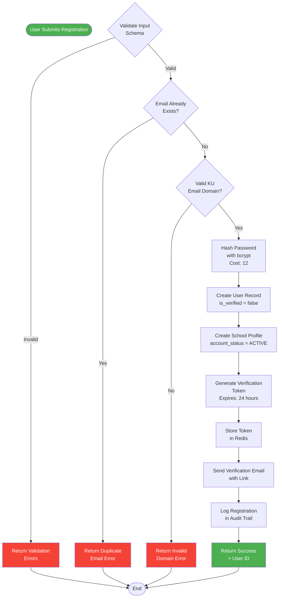
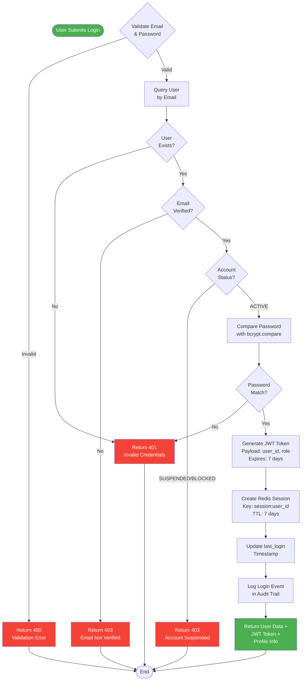
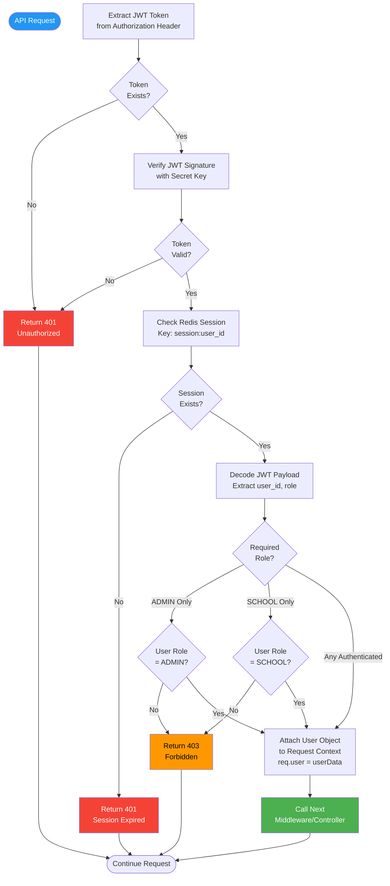
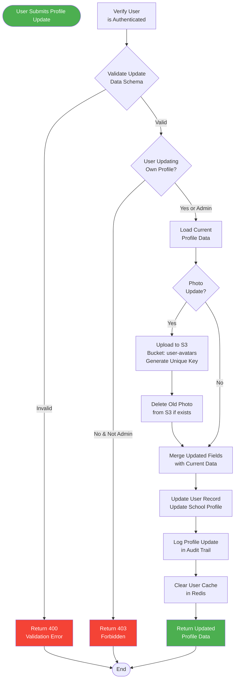

# User Management Module - Structure Chart

## Module Overview
Handles user registration, authentication, profile management, and access control for both school users and administrators.

---

## Main Structure Chart

```mermaid
graph TB
    MAIN["User Management Module"]
    
    MAIN --> REG["Registration<br/>Controller"]
    MAIN --> AUTH["Authentication<br/>Controller"]
    MAIN --> PROFILE["Profile Management<br/>Controller"]
    MAIN --> ACCESS["Access Control<br/>Middleware"]
    
    REG --> VAL_REG["Validate Registration<br/>Data"]
    REG --> CHECK_EMAIL["Check Email<br/>Uniqueness"]
    REG --> SEND_VERIFY["Send Verification<br/>Email"]
    REG --> CREATE_USER["Create User<br/>Record"]
    
    AUTH --> VAL_LOGIN["Validate Login<br/>Credentials"]
    AUTH --> VERIFY_PASS["Verify Password<br/>(bcrypt)"]
    AUTH --> GEN_TOKEN["Generate JWT<br/>Token"]
    AUTH --> CREATE_SESSION["Create Session<br/>(Redis)"]
    AUTH --> LOGOUT["Logout &<br/>Destroy Session"]
    
    PROFILE --> GET_PROFILE["Get User<br/>Profile"]
    PROFILE --> UPDATE_PROFILE["Update Profile<br/>Data"]
    PROFILE --> CHANGE_PASS["Change Password"]
    PROFILE --> UPLOAD_AVATAR["Upload Profile<br/>Photo (S3)"]
    
    ACCESS --> VERIFY_TOKEN["Verify JWT<br/>Token"]
    ACCESS --> CHECK_ROLE["Check User<br/>Role"]
    ACCESS --> CHECK_PERM["Check<br/>Permissions"]
    
    VAL_REG --> DB_USER[("Users DB")]
    CHECK_EMAIL --> DB_USER
    CREATE_USER --> DB_USER
    SEND_VERIFY --> EMAIL_SVC["Email Service"]
    
    VAL_LOGIN --> DB_USER
    VERIFY_PASS --> DB_USER
    CREATE_SESSION --> REDIS[("Redis Cache")]
    GEN_TOKEN --> REDIS
    LOGOUT --> REDIS
    
    GET_PROFILE --> DB_USER
    GET_PROFILE --> DB_SCHOOL[("School Profile DB")]
    UPDATE_PROFILE --> DB_SCHOOL
    CHANGE_PASS --> DB_USER
    UPLOAD_AVATAR --> S3["S3 Storage"]
    
    VERIFY_TOKEN --> REDIS
    CHECK_ROLE --> DB_USER
    
    style MAIN fill:#e1f5ff
    style DB_USER fill:#336791,color:#fff
    style REDIS fill:#dc382d,color:#fff
    style S3 fill:#ff9900,color:#000
```



---

## Registration Process Flow



---

## Authentication Process Flow



---

## Authorization Middleware Flow



---

## Profile Update Process



---

## Function Specifications

### 1. registerUser()
**Purpose**: Create new user account with email verification  
**Input**: 
- email (string, required)
- password (string, min 8 chars, required)
- full_name (string, required)
- phone_number (string, optional)
- school_name (string, required for SCHOOL type)
- registration_number (string, required for SCHOOL type)

**Output**: 
```json
{
  "success": true,
  "user_id": "uuid",
  "message": "Verification email sent"
}
```

**Algorithm**:
1. Validate input schema
2. Check email uniqueness
3. Verify KU email domain (@ku.ac.ke or @students.ku.ac.ke)
4. Hash password (bcrypt, cost 12)
5. Create USER record (is_verified = false)
6. Create SCHOOL_PROFILE record
7. Generate verification token (24h expiry)
8. Store token in Redis
9. Send verification email via SendGrid
10. Log action in AUDIT_LOG
11. Return success response

**Error Handling**:
- 400: Validation errors
- 409: Duplicate email
- 422: Invalid email domain
- 500: Database/service errors

---

### 2. loginUser()
**Purpose**: Authenticate user and create session  
**Input**:
- email (string, required)
- password (string, required)

**Output**:
```json
{
  "success": true,
  "token": "jwt_token_string",
  "user": {
    "user_id": "uuid",
    "email": "user@ku.ac.ke",
    "full_name": "John Doe",
    "user_type": "SCHOOL",
    "profile": {...}
  }
}
```

**Algorithm**:
1. Validate input
2. Find user by email
3. Check if user exists
4. Verify email is verified
5. Check account status (ACTIVE)
6. Compare password hash (bcrypt.compare)
7. Generate JWT token (7 day expiry)
8. Create Redis session (TTL 7 days)
9. Update last_login timestamp
10. Log login in AUDIT_LOG
11. Return token + user data

**Error Handling**:
- 400: Validation errors
- 401: Invalid credentials
- 403: Email not verified or account suspended
- 500: System errors

---

### 3. verifyToken()
**Purpose**: Middleware to verify JWT and attach user to request  
**Input**: JWT token from Authorization header  
**Output**: Populates `req.user` object or throws error

**Algorithm**:
1. Extract token from header
2. Verify JWT signature
3. Check Redis session exists
4. Decode payload
5. Check role if required
6. Attach user data to request
7. Call next()

**Error Handling**:
- 401: No token or invalid token
- 403: Insufficient permissions
- 500: Verification errors

---

### 4. updateProfile()
**Purpose**: Update user profile information  
**Input**:
- user_id (from JWT)
- Updates object (partial profile data)

**Output**: Updated user profile object

**Algorithm**:
1. Verify authentication
2. Check permission (own profile or admin)
3. Validate update data
4. Handle photo upload to S3 if present
5. Merge updates with current data
6. Update database records
7. Clear user cache
8. Log action
9. Return updated profile

**Error Handling**:
- 400: Validation errors
- 403: Permission denied
- 404: User not found
- 500: Update/upload errors

---

## Database Tables Used

| Table | Operations | Purpose |
|-------|-----------|---------|
| USER | CREATE, READ, UPDATE | Core user authentication data |
| SCHOOL_PROFILE | CREATE, READ, UPDATE | Extended school information |
| AUDIT_LOG | CREATE, READ | Track all user actions |

---

## External Dependencies

| Service | Usage | Configuration |
|---------|-------|---------------|
| bcrypt | Password hashing | Cost factor: 12 |
| jsonwebtoken | JWT generation/verification | Secret: env.JWT_SECRET, Expiry: 7d |
| Redis | Session storage | TTL: 7 days |
| SendGrid | Email verification | API Key: env.SENDGRID_API_KEY |
| AWS S3 | Profile photo storage | Bucket: labsych-user-avatars |
